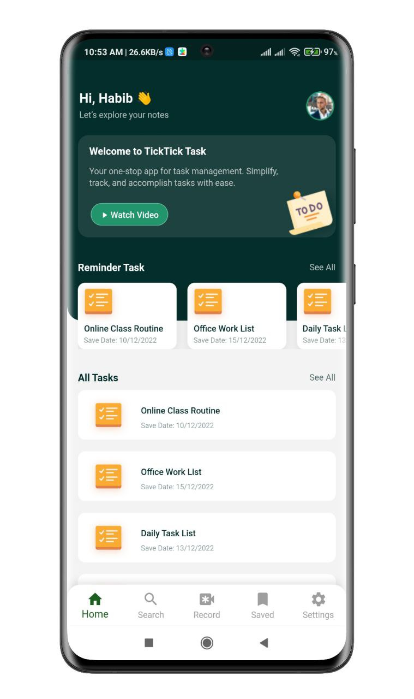

# Figma to Flutter Code

This is an assignment app from IRD Foundation. The task is: Pixel Perfect Figma to Flutter code and Reminder Task will be slideable and All Task will be scrollable.
## Screenshots

### Figma Desgin
<p align="center">
  
</p>

### Flutter Output
<p align="center">
  
</p>

## Figma Design Link

[click here](https://www.figma.com/file/d6wSu91ZIszLJlD5H4hUoN/Intern-Developer-(Copy)?node-id=0%3A1&t=SSO2zzzSFxu63Z7I-1)
## Setup

Clone the repository

```bash
  git clone https://github.com/muradhossin/IRD_Foundation_Project.git
```
Move to the desired folder

```bash
  cd \IRD_Foundation_Project.git
```
To run the app, simply write

```bash
  flutter pub get
```
```bash
  flutter run
```
## Tech Stack

**Built With:** Dart, Flutter


## Platform

- Android


## Contributing

Contributions are always welcome!

See `contributing.md` for ways to get started.

Please adhere to this project's `code of conduct`.


## License

[MIT](https://choosealicense.com/licenses/mit/)


## Support

For support, please contact here [](https://linkedin.com/in/md-murad-hossin)

  💰 You can help me by Donating
  [](https://buymeacoffee.com/muradhossin) 
